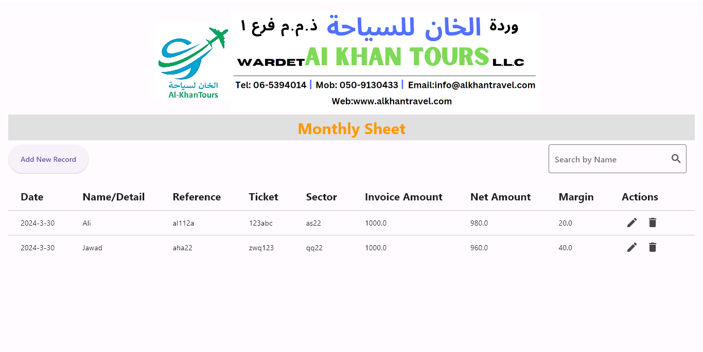

# Tours App

Tours App is a Flutter-based window application designed to manage tour records efficiently. It allows users to add, view, edit, and delete tour records conveniently.

## Features

- **Add New Record**: Users can add new tour records easily.
- **View Records**: Users can view existing tour records with details such as date, name/detail, ticket, sector, invoice amount, net amount, and margin.
- **Edit Records**: Users can edit existing tour records to update information.
- **Delete Records**: Users can delete tour records if needed.
- **Search Functionality**: The app provides a search feature to filter tour records based on the name.

## Screenshots

## Getting Started

To get started with Tours App, follow these steps:

1. **Clone the Repository**: Clone this repository to your local machine.

2. **Install Dependencies**: Navigate to the Installer directory in project open zip and install .xe file and install.

3. **Run the App**: Run the application on an virtual machine or physical device.

## Contributing

Contributions are welcome! If you encounter any bugs, have feature requests, or want to contribute enhancements, please feel free to open an issue or submit a pull request.

## License

This project is licensed under the [MIT License](LICENSE).

## Acknowledgements

- [Flutter](https://flutter.dev/) - UI toolkit for building natively compiled applications for mobile, web, and desktop from a single codebase.
- [Dart](https://dart.dev/) - Programming language optimized for building fast apps on any platform.

